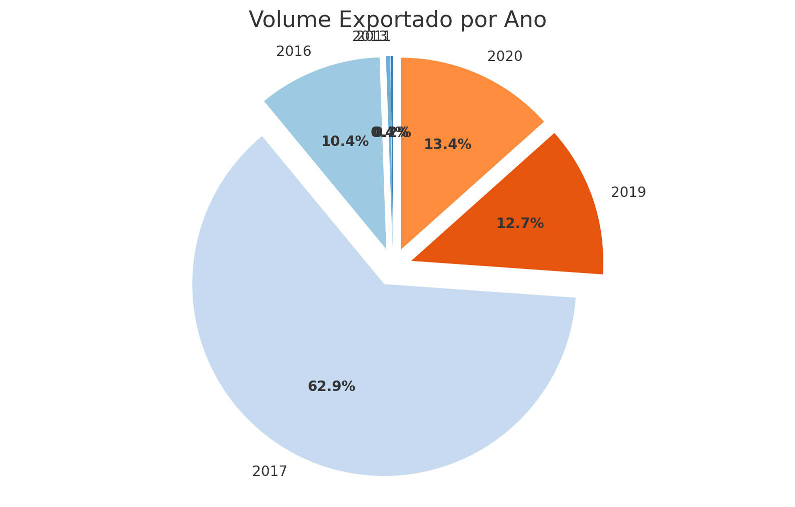

### Step message_creation

Para gerar um gráfico de rosca estilizado com a relação do volume exportado por ano, primeiro precisamos carregar e analisar os dados do arquivo fornecido. Vamos começar carregando o arquivo e visualizando as primeiras linhas para entender sua estrutura.
### Step tool_calls

```
import pandas as pd

# Carregar os dados do arquivo fornecido
file_path = '/mnt/data/file-QnzjJASRRDa3Fy5GQyPSZ5'
data = pd.read_csv(file_path)

# Visualizar as primeiras linhas dos dados
data.head()
```
### Step message_creation

Os dados possuem diversas colunas, incluindo o ano (`year`) e o volume exportado (`volume`). Vamos agora criar um gráfico de rosca para representar a relação do volume exportado por ano de forma estilizada.

Para isso, utilizaremos a biblioteca `matplotlib` para gerar o gráfico. Vamos começar agrupando os dados por ano e somando o volume exportado em cada ano. Em seguida, criaremos o gráfico de rosca.
### Step tool_calls

```
import matplotlib.pyplot as plt

# Agrupar os dados por ano e somar o volume exportado em cada ano
volume_by_year = data.groupby('year')['volume'].sum()

# Criar o gráfico de rosca
fig, ax = plt.subplots()
colors = plt.cm.tab20c.colors  # Escolher uma paleta de cores
explode = (0.05, 0.05, 0.06, 0.05, 0.05)  # Destacar algumas fatias

wedges, texts, autotexts = ax.pie(volume_by_year, explode=explode, labels=volume_by_year.index, autopct='%1.1f%%',
                                  startangle=90, colors=colors)

plt.setp(autotexts, size=10, weight="bold")
plt.setp(texts, size=10)

plt.axis('equal')  # Equal aspect ratio ensures that pie is drawn as a circle

plt.title('Volume Exportado por Ano')

plt.show()
```
### Step message_creation

Parece que ocorreu um erro ao tentar criar o gráfico de rosca devido ao tamanho do parâmetro `explode`. Vou corrigir esse problema e tentar plotar o gráfico novamente.
### Step tool_calls

```
# Definir o tamanho correto para o parâmetro explode com base no número de anos
explode = tuple([0.1] * len(volume_by_year))

# Criar o gráfico de rosca corrigido
fig, ax = plt.subplots()

wedges, texts, autotexts = ax.pie(volume_by_year, explode=explode, labels=volume_by_year.index, autopct='%1.1f%%',
                                  startangle=90, colors=colors)

plt.setp(autotexts, size=10, weight="bold")
plt.setp(texts, size=10)

plt.axis('equal')  # Equal aspect ratio ensures that pie is drawn as a circle

plt.title('Volume Exportado por Ano')

plt.show()
```
### Step message_creation

Imagem sample_image salva!
 